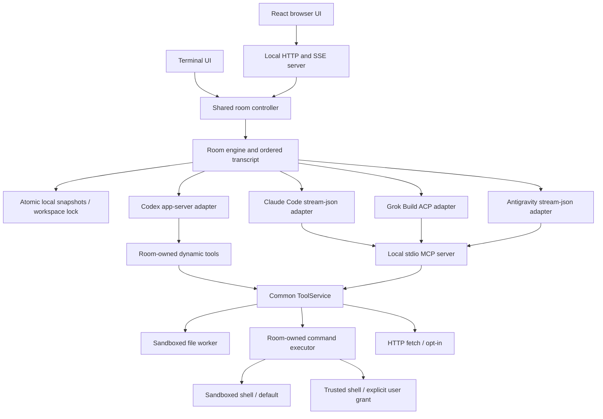

# Architecture

## Find the change

| Maintenance task                 | Supported boundary                                             | Guide                                                     |
| -------------------------------- | -------------------------------------------------------------- | --------------------------------------------------------- |
| Present conversation facts       | `RoomSnapshot` and helpers in `src/snapshot.ts`                | [Change rendering](maintenance.md#change-rendering)       |
| Change browser composer recovery | `ComposerController` in `web/composer.ts`                      | [Change rendering](maintenance.md#change-rendering)       |
| Add shared room input            | `RoomController.submit` / `submitDraft` in `src/controller.ts` | [Add a room command](maintenance.md#add-a-room-command)   |
| Maintain a provider transport    | `AgentAdapter` in `src/types.ts`                               | [Maintain a provider](maintenance.md#maintain-a-provider) |
| Maintain version-1 storage       | `Persistence` / `SessionStore` in `src/store.ts`               | [Evolve saved data](maintenance.md#evolve-saved-data)     |

These are repository interfaces, not a published package API. Source and test
imports use relative paths ending in `.js`, for example `../src/controller.js`
from a test. Browser sibling imports are extensionless, such as `./composer`,
under `web/tsconfig.json`'s Bundler resolution; imports from `web/` into `../src/`
retain `.js`. The guides link the [display](display-contract.md),
[composer submission](attachments-contract.md#composer-submission-result),
[browser composer](browser-composer.md), [provider adapter](adapter-contract.md)
and [saved-format](saved-format-contract.md) contracts. Those documents own the
detailed rules; this map identifies where a change belongs.

A **room** owns scheduling and the public transcript. A **session** is its saved
conversation. An **agent** is a named participant; its **provider** selects the
CLI transport. A message's **deliveries** track each recipient's obligations;
its **roots** identify originating human exchanges. A **checkpoint** is bounded
public reconstruction context, not a permission grant or a replacement for the
exact transcript.

## Dependency boundaries and decisions

- Terminal and browser submissions meet at the controller. Its queue preserves
  ordering and checks supplied conversation IDs before executing an action.
  `submitDraft` owns server-side draft recovery and reports typed results;
  clients do not reconstruct commitment from history or draft counters.
- Room owns routing, scheduling and recovery. Adapters translate provider
  protocols through `AgentAdapter`; they retain distinct transports and native
  permission enforcement. Shared tools enforce room policy.
- Renderers consume the [display contract](display-contract.md). Its structural
  `RoomSource` keeps engine imports out of the browser. Presenting an existing
  fact can stay in the renderer; adding a fact may require a producer change.
  Browser recovery transitions belong to `web/composer.ts`, which composes
  `AttachmentDraft`; React owns presentation and routes intentions to it.
- `Persistence` keeps the synchronous save boundary explicit. Provider state
  supplements the saved public conversation; saved permissions never authorize
  the current process.
- `web/` is the browser UI shipped with the CLI. The separate public website
  lives in [chittr/chittr.dev](https://github.com/chittr/chittr.dev).

These record existing choices. They do not require a new command registry,
controller encapsulation, a shared adapter base class or a storage redesign.

## Runtime map

`src/config.ts` validates two YAML layers and merges room settings field by field. The project `agents` roster takes precedence as a whole; when absent, user `defaultAgents` supplies the roster. Legacy user `agents` is a fallback alias. Agent fields never merge between rosters, and only the selected roster's instruction files are read. The loader records provenance and fingerprints provider/model/instruction identity and the skill catalogue. Agent keys supply the visible labels, addressing handles, and saved identities; providers select the CLI. Reload applies only while idle. The scheduler holds all dispatch during room-policy changes.

`src/skills.ts` discovers provider-specific bundles when configuration loads. A bundle has an installed path, pinned canonical root, bounded manifest metadata, and a manifest digest. Agents receive catalogue metadata, then use room tools to read the instructions and supporting files. `src/skill-access.ts` checks installed links against the pinned roots and confines nested links to discovered bundles. The adapters pass only that provider's grants to the common file/command sandbox; Claude's MCP worker receives the same grants. File tools and sandboxed commands allow bundle reads and explicitly deny bundle writes. Trusted commands have broader account access, including skill writes. Reload replaces grants and resets provider context for changed catalogues; native skill execution remains disabled.

`src/controller.ts` serializes commands and owns conversation switching for both interfaces. Browser requests include the expected conversation ID, so an action from a stale tab cannot enter another conversation. Composer submission goes through `submitDraft`, which owns draft clearing, dispatch, attachment commitment classification and guarded recovery for the terminal and browser paths and returns the typed [submission result](attachments-contract.md#composer-submission-result); the interfaces consume that result rather than message history or draft counters. `src/completion.ts` shares recipient, command, and workspace-path completion. `src/snapshot.ts` is the [display contract](display-contract.md): the plain-data projection both interfaces render, plus narrow current-input reads for completion and history.

`src/room.ts` owns routing and concurrency. Each named agent has one active turn; separate agents run concurrently. A turn gets a fixed public-context snapshot and a FIFO batch of required messages. The entire structured result is validated before any contribution becomes public. It cannot omit an obligation, answer the same message twice, address an unknown participant, or generate unsolicited outcomes. Passes update delivery state without generating a chat message.

Each public message has a monotonic ID and originating human exchange IDs. Before dispatch the engine reserves one follow-up turn per represented root and saves the attempt. An interrupted or failed dispatched attempt keeps its charge. Capped obligations remain queued but are skipped when selecting other independent runnable work. Batches contain at most 32 messages and normally at most 64 KiB of required message text.

`src/protocol.ts` defines the outcome schema, room rules, incremental text preview, and context envelopes. Optional `awaitingHuman` metadata separates a question needing the human from an ordinary answer directed to the human. A bounded extractive digest labels omitted historical detail; `read_conversation` retrieves exact public records from a fixed host-supplied snapshot. It accepts message IDs or pagination, never a model-selected filesystem path.

`src/adapters/` translates transport-specific receipt, activity, streaming, completion, cancellation, and session restoration. Codex uses JSON-RPC over app-server stdio. Claude uses the CLI's stream-json/control protocol and the MCP SDK for local task tools. There is no Claude Agent SDK dependency and no SDK subscription-token workaround.
See the [provider adapter contract](adapter-contract.md) for lifecycle rules
and deterministic conformance checks.

Grok uses ACP with a generated tool profile, verifies the effective tool inventory and subscription auth mode, waits for the room MCP server, and approves only identified room tool calls. Its native structured-output mode currently prevents tool use, so the profile supplies the schema and Chittr validates the completed JSON. Antigravity uses stream-json with a custom agent that has the native completion tool and inherited room MCP tools. Generated permissions and a tool hook block native task tools. Its startup inventory describes the global registry, not the selected profile, so startup runs one bounded enforcement probe with task tools denied, asking the profile for one native write on a host-named file inside its scratch directory, and admits the session only when the hook recorded exactly that denial and nothing appeared in the directory; no CLI version is compared. Both use isolated homes and working directories while MCP workers receive the actual launch directory. Native profiles are disposable; reconnect restores the public transcript with a visible reset notice.

`src/tools.ts` exposes the same task policy to all providers. File tools and sandboxed commands use a deny-default macOS sandbox. The file worker performs lexical, real-path and symlink checks as well. Sandboxed commands get a small explicit environment and a private temporary directory. Trusted commands use the unfiltered launch environment captured by the CLI before provider startup, and execute without `sandbox-exec`. Each adapter has a ToolService in the room process with a fixed participant policy. Codex invokes it directly. Claude, Grok, and Antigravity forward commands from MCP to it, so provider isolation does not change the command environment. Tool processes are process-group children so stop can terminate descendants. Output limits, timeouts, cancellation and visible provider tool activity remain in place. Fixed history snapshots are separate from filesystem tools.

`src/command-broker.ts` binds each MCP command endpoint to one participant's ToolService and policy snapshot. Only command text and timeout are accepted after capability authentication; callers cannot supply environment, workspace, participant or permissions. Endpoints live in private per-participant directories under `/private/tmp/chittr-command-brokers-<uid>`, separate from command scratch. A mode-0600 capability file avoids passing authentication values in argv. Every file/command sandbox explicitly denies this runtime directory and outbound Unix socket connections to it, including when the workspace is an ancestor or network is enabled. Disconnect aborts the command; closing an adapter revokes its endpoint and kills active commands. Reconnect/reload creates new endpoints. No launch environment values enter MCP configuration, saved room settings or config displays.

`src/command-access.ts` derives command mode after the ordinary permission merge. User-only `trustedCommands.workspaces` grants exact canonical workspaces without descendants. Persistent grants activate only with all booleans enabled; otherwise the effective mode and inactive reasons remain visible. `--trusted-commands` requires all booleans and lives for the process only. Project trust declarations are rejected. Mode changes participate in reload comparison and start fresh provider sessions with current instructions and public room history. Saved command mode is historical metadata, never authorization; the controller reloads current configuration when switching conversations.

`src/store.ts` saves mode-0600 snapshots with fsync and atomic rename, and records the latest session. A workspace lock prevents competing normal writers. Restoring a conversation clears saved room and participant pauses and dispatches eligible queued messages as enabled agents connect. Abandoned active deliveries become interrupted and, like failed deliveries, require explicit retry. Follow-up limits remain in force. The room is the recovery authority; native provider state supplements it. A save failure pauses further dispatch and is reported as a storage failure. See the [saved format contract](saved-format-contract.md) for the on-disk layout, the load-classification table, the two write paths on a read, and the backup recovery unit.

`src/ui/` parses raw input separately from rendering. Bracketed paste and split UTF-8/escape sequences are decoded incrementally. Draft cursor movement respects grapheme boundaries; the renderer wraps by terminal display width. History uses a message-line anchor while scrolled, so streaming does not pull the reader back to the bottom. The UI never gives input ownership to provider subprocesses. Each frame renders one projection from the [display contract](display-contract.md); the room is kept only for events, draft persistence, submission checks and identity guards.

`src/web.ts` attaches an HTTP server to the controller on an ephemeral IPv4 loopback port. The browser keeps a random per-launch token in origin-scoped tab storage and sends it as a bearer credential for API requests, the event stream and image reads. Cookies do not grant room access. Authenticated image reads use temporary blob URLs that are revoked when the image changes or unmounts. Exact Host/Origin checks prevent cross-site access and DNS rebinding. Static serving uses an explicit map of built UI assets. There is no workspace-file serving endpoint. CSP disallows remote resources, inline scripts, and framing; Markdown omits raw HTML and images.

The server coalesces state changes into SSE snapshots at most once every 60 ms. Each new connection receives current public state, without replaying actions. Slow event clients reconnect instead of accumulating unbounded output. Command IDs retain their input digest and result for the lifetime of the process. A repeated ID with identical input returns the same result; changed input is rejected. After 10,000 distinct commands the server requires a restart rather than forgetting old receipts. Draft versions prevent delayed autosaves from restoring already-sent text.

`web/` contains the React/TypeScript UI, built by Vite into `dist/web`. It renders the same [display contract](display-contract.md) the terminal uses, received as the SSE state payload with transport metadata added. `web/composer.ts` is the [browser composer module](browser-composer.md): it owns the recoverable composer state, local draft persistence, submission identity and the mapping of the submission result to browser state, while `web/main.tsx` renders that state and submits intentions. Browser drafts and pending request IDs survive tab refresh in session storage. The server stores connected draft updates through the same room persistence as the terminal. A lost acknowledgment leaves the composer held until the user checks the original request. Browser disconnection does not stop agents. Explicit quit and process signals close the room, event streams, and listening server.

The deterministic tests cover state transitions, keyboard mechanics, local HTTP authentication, command deduplication, draft ordering, and session switching. Playwright drives the built browser UI with deterministic peers. Separate scripts test the actual terminal through a PTY, native macOS permission enforcement, each live provider adapter, and an end-to-end peer conversation. The live tests are deliberately opt-in because they use the existing subscription allowance.

## Context maintenance

`Room.compact` registers a separate per-agent operation and returns immediately.
Its controller, provider resources, and completion promise live outside ordinary
message attempts. The scheduler holds that agent until maintenance settles;
it does not change delivery statuses or exchange allowances. Stop and close
abort the operation and await every prepared adapter and summarizer. Checkpoint
writers use a serialized queue, including cancellation while awaiting the writer.

Adapters have separate `compact` and `maintain` methods. Maintenance has its own
operation ID and parsed response; it never reaches `parseOutcomes`. Codex uses
per-turn schemas. Process-based adapters admit a maintenance response in their
process schema while retaining strict normal-outcome validation. During
maintenance, the room's shared tool gate denies every task tool, including
`read_conversation`, in the parent and MCP process. Codex also leaves its normal
turn signal unset. Provider subscription authentication and native restrictions
are unchanged. An isolated summarizer gets only explicit public context.
Continuation notes require a source-context route the live adapter can attempt;
providers without one, and a source session whose handoff fails, persist an
unavailable-note record with the reason instead of inventing private state.

The following UTF-8 byte budgets are acceptance limits, not token estimates:

| Input or record                                                         | Maximum bytes |
| ----------------------------------------------------------------------- | ------------: |
| Each summarizer input                                                   |       131,072 |
| Accepted summarizer output                                              |        32,768 |
| Checkpoint record                                                       |        24,576 |
| Individual continuation note                                            |         4,096 |
| Recent public tail                                                      |        16,384 |
| Complete reconstruction seed                                            |        65,536 |
| Pre-swap next turn, including exact required messages and reply targets |       131,072 |

Each bounded chunk runs in a fresh summarizer session with the preceding
checkpoint, so native summarizer context cannot grow with conversation length.
No public message is split or clipped for generation. A message that cannot
fit fails the operation. The recent tail contains whole messages; covered older
messages remain in the checkpoint and exact transcript. The seed limit leaves
room for a subsequent normal turn. These conservative byte limits cannot
promise a particular provider's remaining token capacity. Seed acceptance is
required before swap, and provider overflow remains a visible failure.

The room freezes a public snapshot inside the checkpoint writer. It validates
source IDs and authors against that snapshot, builds the seed, and obtains a
structural `seed accepted` acknowledgement before committing a candidate session.
The checkpoint version, consumed version, provider reference, replay cursor, and
continuation note consumption reference are saved together. The in-memory
reference changes synchronously after that save succeeds, then the old adapter
closes. New arrivals remain queued and are not marked answered merely because
they appear in checkpoint context. Required messages and their exact reply
targets still appear on the next normal turn. The pre-swap bound does not impose
a new permanent limit on later ordinary turns. When no public messages follow
the latest checkpoint, reconstruction reuses its version and records consumption
by the new provider session without appending a duplicate checkpoint.

Version-1 saved sessions remain readable without auxiliary records. Missing
native state uses the same bounded reconstruction, generating a checkpoint from
public history if none exists. Policy and fingerprint changes retain digest replay under current
instructions. Interrupted maintenance resumes from the last committed reference
and holds the affected agent for explicit reconnect. Invalid auxiliary records
are skipped with a notice; invalid maintenance holds its target, or the room
when its target is unreadable. The original file is retained as
`invalid-auxiliary-<uuid>.json` before the next save. Core history corruption still
rejects the session. Neither a checkpoint nor a continuation note grants tools
or permissions.
